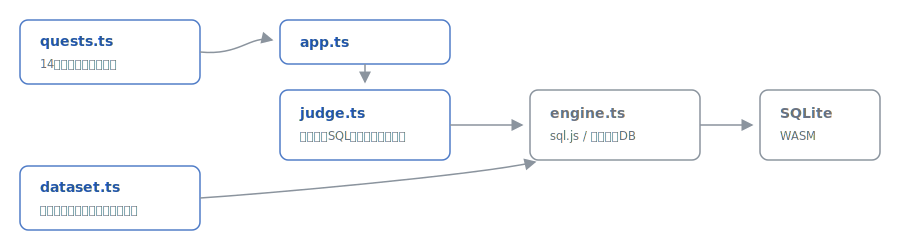

# sqlquest

[](https://github.com/miruky/sqlquest/actions/workflows/ci.yml)
[](https://www.typescriptlang.org/)
[](https://sql.js.org/)
[](https://vitest.dev/)
[](https://opensource.org/licenses/MIT)

**ブラウザ内のSQLiteに本物のクエリを書いて、商店街のデータから答えを探すSQL学習ゲームです。**

## 概要

舞台は架空の「やまびこ商店街」。店・商品・顧客・注文の5テーブルからなるデータベースに対して、「売り切れの商品はどれか」「売上トップ3は何か」といった18のクエストにSQLで答えます。実行エンジンはsql.js(SQLiteのWASM版)なので、サーバーは不要で、JOINもサブクエリもHAVINGも本物のSQLとして動きます。判定は模範解答のクエリを同じデータベースで実行した結果との照合で行うため、列名の付け方や書き方が違っても、取り出した値が正しければ合格です。表示テーマ(自動 / ライト / ダーク)も選べます。

試す: https://miruky.github.io/sqlquest/

### なぜ作ったのか

SQLの文法解説はいくらでもありますが、手を動かす練習となるとデータベースの準備が最初の壁になります。ブラウザを開いた瞬間にデータの入ったSQLiteが手元にあり、間違えたら「期待される結果」と自分の結果を並べて見比べられる。穴埋めや選択式ではなく白紙にクエリを書く練習がしたくて作りました。実行のたびにデータベースを作り直すので、DROP TABLEを試しても誰も困りません。

## 使い方

- 左の一覧からクエストを選び、SQLを書いて「実行して判定」を押します(Ctrl+Enterでも可)
- 見出しの「‹」「›」で一覧順に前後のクエストへ移れます。合格すると結果に「次のクエストへ」が出ます
- 不合格のときは理由(列の数・行数・値の違い)と、期待される結果が表に並びます
- 右のテーブル一覧で各テーブルの列と先頭5行を確認できます
- ORDER BYが課題のクエストだけは行の並び順も採点され、それ以外は順不同で照合します
- 右上のボタンで表示テーマを 自動 / ライト / ダーク に切り替えられます(選択はブラウザに保存)

## アーキテクチャ



`engine.ts` はsql.jsの薄いラッパーで、実行のたびに使い捨てのDBへ `dataset.ts` のスキーマと初期データを流し込みます。`judge.ts` はユーザーのSQLと模範解答を同じデータの上で実行し、最後の結果セット同士を比較します。数値は丸めてから比べるため浮動小数の表現ゆれで落ちることはなく、列名は採点に含めません。CIでは全クエストについて「模範解答が合格すること」「データの外部キーが壊れていないこと」を機械検証しています。

## 技術スタック

| カテゴリ | 技術                           |
| :------- | :----------------------------- |
| 言語     | TypeScript 5(strict)           |
| SQL実行  | sql.js(SQLite 3 WASM)          |
| ビルド   | Vite 8                         |
| テスト   | Vitest 4 + happy-dom(95テスト) |
| リンタ   | ESLint + Prettier              |
| CI / CD  | GitHub Actions                 |
| 配信     | GitHub Pages                   |

## プロジェクト構成

- `src/lib/dataset.ts` — 商店街のスキーマと初期データ(SQL)
- `src/lib/engine.ts` — sql.jsのラッパー。使い捨てDBでの実行とスキーマ情報の取得
- `src/lib/quests.ts` — 18クエストの出題・ヒント・模範解答
- `src/lib/judge.ts` — 結果セットの照合と日本語の不一致理由
- `src/lib/theme.ts` — テーマ選択(自動 / ライト / ダーク)の解決ロジック
- `src/app.ts` — 一覧・エディタ・前後移動・結果比較・進捗・テーマのUI
- `docs/architecture.svg` — アーキテクチャ図

## はじめ方

### 前提条件

- Node.js 20.19 以上(CI は 22 で検証)

### セットアップ

```bash
npm ci
npm run dev
```

### テストとlint

```bash
npm test
npm run lint
```

### ビルド

```bash
npm run build
```

GitHub Pagesへは `main` へのpushで自動デプロイされます。サブパス配信のため、ワークフローでは環境変数 `SQLQUEST_BASE=/sqlquest/` を渡してViteの `base` を切り替えています。

## 設計方針

- **判定は結果の照合で**: 正解のSQL文字列と比べるのではなく、模範解答を同じDBで実行した結果と値を照合します。LEFT JOINで解いてもNOT INで解いても、答えが同じなら合格です。
- **データは出題の一部**: 「一度も売れていない商品」や「3位タイが生じない売上」など、答えが一意に定まるよう初期データを設計し、その性質自体をテストで固定しています。
- **壊して学べる**: 実行のたびに新しいDBを作るので、UPDATEやDROPの実験も自由です。ただし複数文を書いた場合に採点されるのは最後の結果セットで、SELECT以外しか書かなければ不合格になります。診断メッセージのうちSQLiteのエラーは英語のままです。

## ライセンス

[MIT](LICENSE)
